# 🐳 Moodle con Docker Compose

Implementación de **Moodle** (plataforma de aprendizaje en línea) usando **Docker Compose** con base de datos **MariaDB**.

---

## 📁 Estructura del proyecto

```
prueba1/
│
├── docker-compose.yaml   # Archivo principal de configuración
├── php.ini               # Config opcional (si se copia del contenedor)
└── README.md             # Documentación del proyecto
```

---

## ⚙️ 1. Configuración del archivo `docker-compose.yaml`

Copia y pega lo siguiente dentro del archivo `docker-compose.yaml`:

```yaml
services:
  mariadb:
    image: bitnami/mariadb:latest
    environment:
      - MARIADB_ROOT_PASSWORD=12345
      - MARIADB_DATABASE=jm_base
      - MARIADB_USER=jm
      - MARIADB_PASSWORD=1234
      - MARIADB_CHARACTER_SET=utf8mb4
      - MARIADB_COLLATE=utf8mb4_unicode_ci
    volumes:
      - 'mariadb_data:/bitnami/mariadb'

  moodle:
    image: docker.io/bitnamilegacy/moodle:4.3
    depends_on:
      - mariadb
    ports:
      - '8080:8080'
      - '8443:8443'
    environment:
      - MOODLE_DATABASE_HOST=mariadb
      - MOODLE_DATABASE_PORT_NUMBER=3306
      - MOODLE_DATABASE_NAME=jm_base
      - MOODLE_DATABASE_USER=jm
      - MOODLE_DATABASE_PASSWORD=1234
      - MOODLE_USERNAME=admin
      - MOODLE_PASSWORD="Admin123!"
      - MOODLE_EMAIL=admin@example.com
    volumes:
      - 'moodle_data:/bitnami/moodle'
      - 'moodledata_data:/bitnami/moodledata'

volumes:
  mariadb_data:
    driver: local
  moodle_data:
    driver: local
  moodledata_data:
    driver: local
```

---

## 🚀 2. Levantar el entorno

Ejecuta los siguientes comandos desde la carpeta del proyecto:

```bash
docker compose up -d
docker ps
```

Cuando ambos contenedores estén activos (`mariadb` y `moodle`), abre en tu navegador:

```
http://localhost:8080
o
IP:Port
```

> 🧠 Usuario por defecto:
> - Usuario: `admin`
> - Contraseña: `"Admin123!"`

---

## ⚒️ 3. Modificación del archivo `php.ini`

### 📍 Ubicación dentro del contenedor
```
/opt/bitnami/php/etc/php.ini
```

### 📤 Copiar desde el contenedor a tu máquina, para tener un backup
```bash
docker cp prueba1-moodle-1:/opt/bitnami/php/etc/php.ini .
mv php.ini old-php.ini
```

### 📝 Editar parámetros recomendados
```ini
upload_max_filesize = 100M
post_max_size = 100M
max_execution_time = 300
```
o copiar el php.ini que esta en este repositorio que ya esta modificado

### 📥 Subir el archivo de nuevo al contenedor
```bash
docker cp php.ini prueba1-moodle-1:/opt/bitnami/php/etc/php.ini
docker restart prueba1-moodle-1
```

> 💡 También puedes entrar directamente:
> ```bash
> docker exec -it prueba1-moodle-1 bash
> nano /opt/bitnami/php/etc/php.ini
> ```

---

## 🎓 4. Configuración inicial en Moodle

1. Inicia sesión con el usuario administrador. 

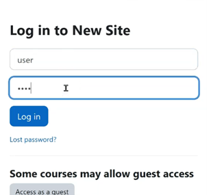

2. Desde el panel principal, selecciona **“My Courses” → “Create Course”**.  
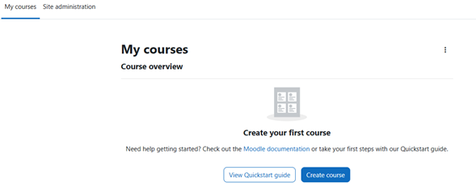
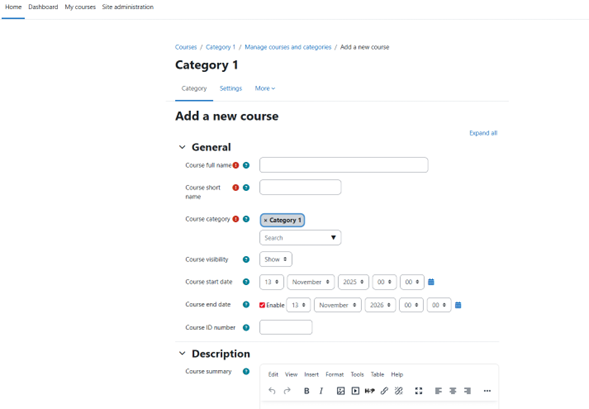

3. Completa los datos del curso y guarda.

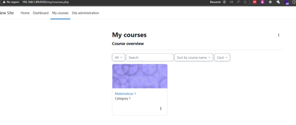

---

## 👥 5. Gestión de usuarios y roles

### ➕ Crear un nuevo usuario
https://docs.moodle.org/400/en/Admin_quick_guide
1. Ir a **Site administration → Users → Add a new user**  
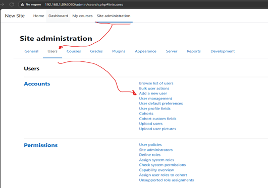

2. Completar los datos y guardar.
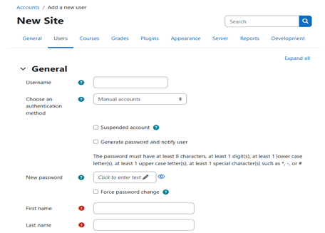
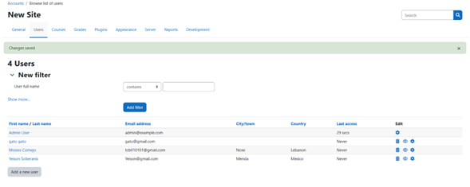

### 🧩 Asignar roles
1. Entra a **Home → Participants**  
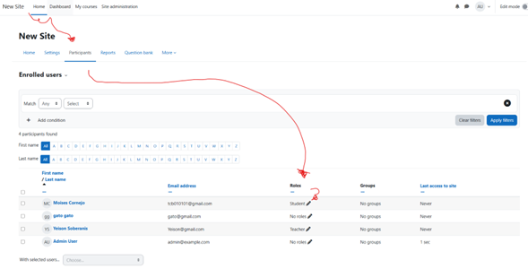

2. Edita el usuario y asigna un rol (*Teacher*, *Student*, etc.)
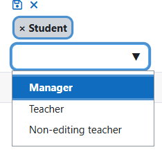

---

## 📚 6. Inscribir usuarios a un curso

1. Accede al curso desde **My Courses**.  
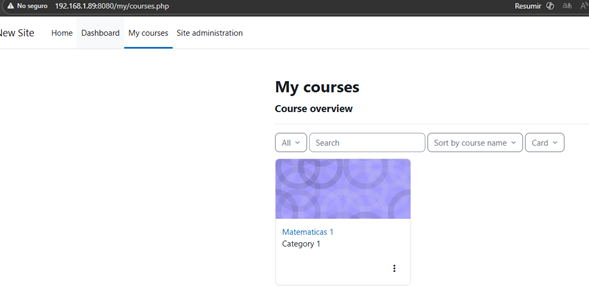

2. Ve a **Participants → Enrol users**.  
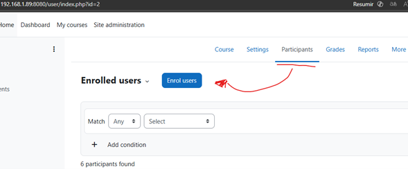

3. Selecciona los usuarios y define su rol.  
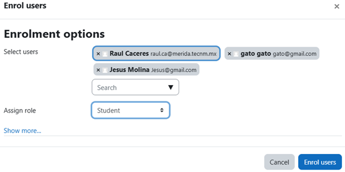

4. Guarda con **Enrol users**.
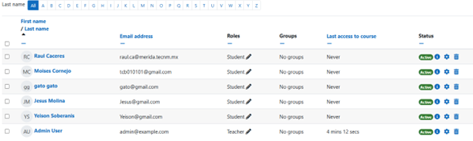

---

## 🧹 7. Limpieza y mantenimiento

### Detener y eliminar todo:
```bash
docker compose down -v
```

### Liberar espacio:
```bash
docker volume prune
```

---

## 🧠 Notas útiles

- Logs del docker completo:
  ```bash
  docker compose logs
  ```

- Logs de Moodle:
  ```bash
  docker compose logs -f moodle
  ```

- Logs de MariaDB:
  ```bash
  docker compose logs -f mariadb
  ```

- Entrar al contenedor:
  ```bash
  docker exec -it prueba1-moodle-1 bash
  ```

---

## 👨‍💻 Autor

**Jesus (jm)**  
📘 Proyecto: *Moodle en Docker con MariaDB*  
🖥️ Sistema base: *Ubuntu Server 22.04*  
📅 Fecha: *2025-11-12*